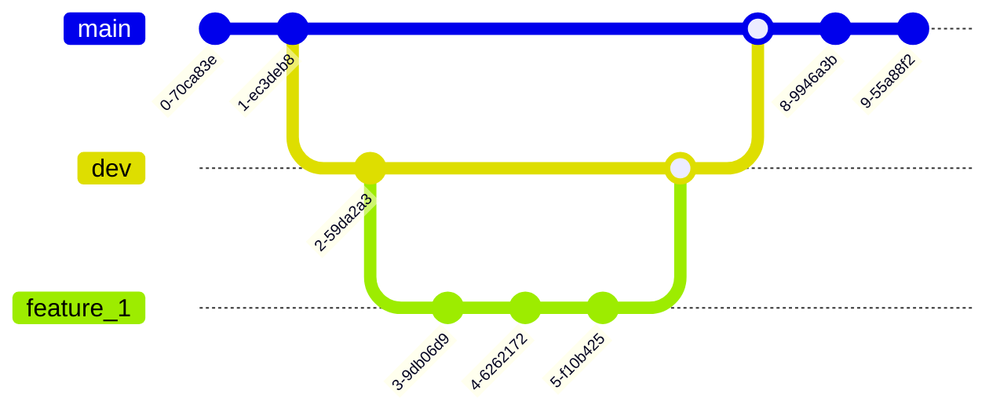

# Xournal++ HTR

Developing [handwritten text recognition](https://en.wikipedia.org/wiki/Handwriting_recognition) for [Xournal++](https://github.com/xournalpp/xournalpp).

*Your contributions are greatly appreciated!*

## Xournal++ HTR in 90 seconds

*([Click on image or here to get to video](https://www.youtube.com/watch?v=boXm7lPFSRQ?utm_source=github&utm_medium=readme&utm_campaign=github_readme).)*

## Installation

### Cross-platform

Execute the following commands:

1. Create an environment: ``conda create --name xournalpp_htr python=3.10.11``.
2. Use this environment: ``conda activate xournalpp_htr``.
3. Install [HTRPipelines](https://github.com/githubharald/HTRPipeline) package using [its installation guide](https://github.com/githubharald/HTRPipeline/tree/master#installation).
4. Install all dependencies of this package ``pip install -r requirements.txt``.
4. Install the package in development mode with ``pip install -e .`` (do not forget the dot, '.').
5. Move `plugin/` folder content to `${XOURNAL_CONFIG_PATH}/plugins/xournalpp_htr/` with `${XOURNAL_CONFIG_PATH}` being the configuration path of Xournal++, see Xournal++ manual [here](https://xournalpp.github.io/guide/file-locations/).

### Linux

Run `bash INSTALL_LINUX.sh` from repository root directory.

This script also installs the plugin as explained in point 5 of the cross-platform installation procedure. The installation of the plugin is performed with `plugin/copy_to_plugin_folder.sh`, which can also be invoked independently of `INSTALL_LINUX.sh` for updating the plugin installation.

### After installation

Confirm that the installation worked by running `make tests-installation` from repository root directory.

## Project description

Taking handwritten notes digitally comes with many benefits but lacks searchability of your notes. Hence, there is a need to make your handwritten notes searchable. This can be achieved with ["handwritten text recognition" (HTR)](https://en.wikipedia.org/wiki/Handwriting_recognition), which is the process of assigning searchable text to written strokes.

While many commercial note taking apps feature great HTR systems to make your notes searchable and there are a number of existing open-source implementations of various algorithms, there is no HTR feature available in an open-source note taking application that is privacy aware and processes your data locally.

    
<b>The purpose of the <i>Xournal++ HTR</i> project is to change that!</b>

Xournal++ HTR strives to bring open-source on-device handwriting recognition to [Xournal++](https://github.com/xournalpp/xournalpp) as it is one of the most adopted open-source note taking apps and thereby HTR can be delivered to the largest possible amount of users.

## Project design

The design of Xournal++ HTR tries to bridge the gap between both delivering a production ready product and allowing contributors to experiment with new algorithms.

The project design involves a Lua plugin and a Python backend, see the following figure. First, the production ready product is delivered by means of an Xournal++ plugin. The plugin is fully integrated in Xournal++ and calls a Python backend that performs the actual transcription. The Python backend allows selection of various recognition models and is thereby fully extendable with new models.

    
    
<i>Design of xournalpp_htr.</i>

Developing a usable HTR systems requires experimentation. The project structure is set up to accommodate this need. *Note that ideas on improved project structures are appreciated.*

The experimentation is carried out in terms of "concepts". Each concept explores a different approach to HTR and possibly improves over previous concepts, but not necessarily to allow for freedom in risky experiments. Concept 1 is already implemented and uses a computer vision approach that is explained below.

Future concepts might explore:
- Retrain computer vision models from concept 1 using native data representation of [Xournal++](https://github.com/xournalpp/xournalpp)
- Use sequence-to-sequence models to take advantage of native data representation of [Xournal++](https://github.com/xournalpp/xournalpp)
- Use data augmentation to increase effective size of training data
- Use of language models to correct for spelling mistakes

### Concept 1

This concept uses computer vision based algorithms to first detect words on a page and then to read those words.

The following shows a video demo on YouTube using real-life handwriting data from a Xournal file:

Despite not being perfect, the main take away is that the performance is surprisingly good given that the underlying algorithm has not been optimised for Xournal++ data at all.

**The performance is sufficiently good to be useful for the Xournal++ user base.**

Feel free to play around with the demo yourself using [this code](https://github.com/PellelNitram/xournalpp_htr/blob/master/scripts/demo_concept_1.sh) after [installing this project](#Installation). The "concept 1" is also what is currently used in the plugin and shown in the [90 seconds demo](https://www.youtube.com/watch?v=boXm7lPFSRQ).

Next steps to improve the performance of the handwritten text recognition even further could be:
- Re-train the algorithm on Xournal++ specific data, while potentially using data augmentation.
- Use language model to improve text encoding.
- Use sequence-to-sequence algorithm that makes use of [Xournal++](https://github.com/xournalpp/xournalpp)'s data format. This translates into using online HTR algorithms.

I would like to acknowledge [Harald Scheidl](https://github.com/githubharald) in this concept as he wrote the underlying algorithms and made them easily usable through [his HTRPipeline repository](https://github.com/githubharald/HTRPipeline) - after all I just feed his algorithm [Xournal++](https://github.com/xournalpp/xournalpp) data in concept 1. [Go check out his great content](https://githubharald.github.io/)!

## Usage

1. Activate environment: ``conda activate xournalpp_htr``. Alternatively use ``source activate_env.sh`` as shortcut.
2. Use the code.
3. To update the requirements file: ``pip freeze > requirements.txt``.

## Community contributions

The following branching strategy is used to keep `main` branch stable and
allow for experimentation: `main` > `dev` > `feature branches`.

In more details, this repository currently follows the following git branching strategy: The
`main` branch remains stable and delivers a functioning product. The `dev`
consists of all code that will be merged to `main` soon where the corresponding
features are developed in individual feature branches, see `feature_1` in the
below visualisation. As a whole, the branching strategy is depicted in this
visualisation.

The CI/CD pipeline runs on pushes or merges to `main` and `dev`.

## Acknowledgements

I would like to thank [Leonard Salewski](https://twitter.com/L_Salewski) and [Jonathan Prexl](https://scholar.google.com/citations?user=pqep1wkAAAAJ&hl=en) for useful discussions, [Harald Scheidl](https://github.com/githubharald/) for making his repositories about handwritten text recognition public ([SimpleHTR](https://github.com/githubharald/SimpleHTR), [WordDetectorNN](https://github.com/githubharald/WordDetectorNN) and [HTRPipeline](https://github.com/githubharald/HTRPipeline)) and the [School of Physics and Astronomy](https://www.ph.ed.ac.uk/) at [The University of Edinburgh](https://www.ed.ac.uk/) for providing compute power.
