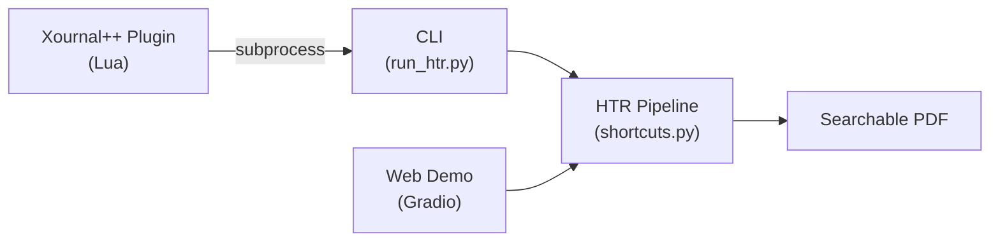
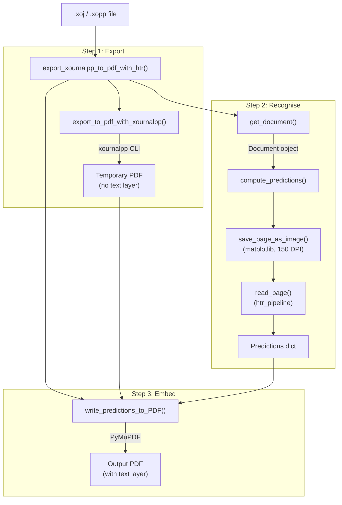

# Architecture

This page describes the architecture of Xournal++ HTR from the perspective of its three user-facing entry points: the **CLI**, the **Xournal++ plugin**, and the **web demo**.

## Overview

All three entry points feed into the same core HTR pipeline, which converts a Xournal++ document (`.xoj`/`.xopp`) into a searchable PDF:



## Entry Points

### CLI (`xournalpp_htr/run_htr.py`)

The command-line interface. Parses arguments via `utils.parse_arguments()` and delegates to `shortcuts.export_xournalpp_to_pdf_with_htr()`.

```bash
python xournalpp_htr/run_htr.py \
    -if input.xopp \
    -of output.pdf \
    [-p PIPELINE_NAME] \
    [-pid PREDICTION_IMAGE_DIR] \
    [-sp]
```

### Xournal++ Plugin (`plugin/main.lua`)

A Lua plugin that integrates into Xournal++ as a menu item (`Tools > Xournal++ HTR`, shortcut `Ctrl+F1`). It prompts the user for a save location and then calls `run_htr.py` via `os.execute`. Configuration (Python path, script path, model) is stored in `plugin/config.lua`.

### Web Demo (`scripts/demo.py`)

A Gradio app deployed as a HuggingFace Space (via `Dockerfile`). It provides a browser-based UI where users upload `.xoj`/`.xopp` files and step through the pipeline interactively. Unlike the CLI and plugin, the demo calls the pipeline functions directly (not via `shortcuts.py`) and displays the first page as a preview. It optionally logs interactions to Supabase for analytics and data donation.

## Core Pipeline

The pipeline in `shortcuts.py` runs three sequential steps:



### Step 1: Export to PDF

`utils.export_to_pdf_with_xournalpp()` shells out to the `xournalpp` CLI to convert the input file into a temporary PDF. This preserves the original visual layout (drawings, backgrounds, etc.).

### Step 2: HTR Predictions

1. **Parse document** -- `documents.get_document()` decompresses the gzip XML and parses it with BeautifulSoup into a `Document` containing `Page` > `Layer` > `Stroke` objects. A factory function dispatches to `XournalDocument` (`.xoj`) or `XournalppDocument` (`.xopp`).

2. **Render pages** -- Each page is rendered to a 150 DPI grayscale image via matplotlib using the stroke coordinates.

3. **Run HTR** -- `compute_predictions()` dispatches on the `--pipeline` argument to one of two implementations:

    - `2024-07-18_htr_pipeline` (default) -- The external `htr_pipeline` library processes each image: an ONNX word detector locates regions (scaled to 40%, 5px margin), DBSCAN groups detections into lines (discarding lines with fewer than 2 words), and a second ONNX model recognises each word via CTC decoding.
    - `2026-06-07_local_pipeline` -- An in-house pipeline that loads our locally-trained ONNX models from HuggingFace Hub (`WordDetectorModel` + `SimpleHTRModel`, see `xournalpp_htr/inference_models.py`) and runs detection + per-word recognition without `htr_pipeline`. Replacing the external dependency entirely is tracked in #125.

    Output is a dictionary mapping page indices to lists of predictions (text + bounding box coordinates in image pixels).

### Step 3: Embed Text in PDF

`xio.write_predictions_to_PDF()` uses PyMuPDF to add text boxes to the temporary PDF from Step 1. Prediction coordinates are already in document units (72 DPI) as per ADR 005, so no conversion is needed here. Text is rendered invisibly (`render_mode=3`) by default, making the PDF searchable without visual clutter. In debug mode (`--show-predictions`), text and bounding boxes are drawn visibly.

## Module Structure

```
xournalpp_htr/
    run_htr.py       # CLI entry point
    shortcuts.py     # Orchestrates Steps 1-3
    documents.py     # .xoj/.xopp parsing (Document ABC, Page, Layer, Stroke)
    models.py        # HTR inference wrapper (compute_predictions, WordPrediction)
    utils.py         # Argument parsing, xournalpp CLI export
    xio.py           # PDF I/O (PyMuPDF), benchmark/example loading (HuggingFace Hub)
    benchmark.py     # Benchmark logic (run_benchmark, precision/recall/CER)

scripts/
    demo.py              # Gradio web demo
    run_benchmark.py     # CLI to run benchmark against xournalpp_htr_benchmark dataset

plugin/
    main.lua         # Xournal++ plugin
    config.lua       # Plugin configuration

external/htr_pipeline/
    HTRPipeline/htr_pipeline/
        __init__.py          # read_page() -- main inference API
        reader/              # ONNX text recognition + CTC decoding
        word_detector/       # ONNX word detection + line clustering
        models/              # Pre-trained ONNX model files
```

## Key Data Structures

**Document model** (from `documents.py`):

- `Document` (ABC) -- holds `pages: list[Page]`, `DPI: int`, renders pages to images
    - `XournalDocument` -- for `.xoj` files
    - `XournalppDocument` -- for `.xopp` files
- `Page` -- `meta_data` (width, height), `background`, `layers: list[Layer]`
- `Layer` -- `strokes: list[Stroke]`
- `Stroke` -- `x: np.array`, `y: np.array`, `meta_data` (color, width, ...)

**Predictions** (from `models.py`):

```python
{
    page_index: [
        {"page_index": int, "text": str,
         "xmin": float, "xmax": float, "ymin": float, "ymax": float},
        ...
    ],
    ...
}
```

Bounding box coordinates are in **document units (72 DPI)**, matching the coordinate system
of stroke data in `Document`. Pipelines that render pages at a higher DPI internally must
convert their raw output before returning (see [ADR 005](ADRs/005_prediction_bounding_box_coordinate_system.md)).

## External Dependencies

| Dependency | Purpose |
|---|---|
| `xournalpp` (CLI) | Exports `.xoj`/`.xopp` to PDF (Step 1) |
| `beautifulsoup4` + `lxml` | Parses document XML |
| `matplotlib` | Renders pages to images for HTR |
| `opencv-python` | Image loading and processing |
| `onnxruntime` | Runs word detection and text recognition models |
| `scikit-learn` | DBSCAN clustering for line detection |
| `pymupdf` | Embeds text into PDF (Step 3) |
| `gradio` | Web demo UI (demo only) |
| `huggingface_hub` | Downloads example files (demo only) |
