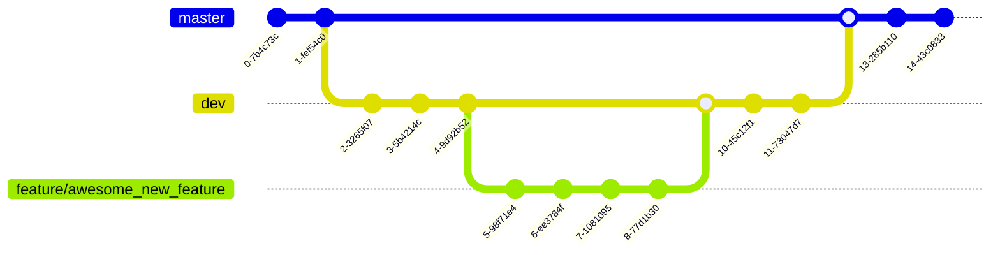

# Contributing

There are multiple ways to contribute to this project. Below, those ways are explained alongside information on how to best contribute from a codebase point of view.

Really, we greatly appreciate any help!

## Issues on Github

A great way to help out with this project is to check [open issues on Github](https://github.com/PellelNitram/xournalpp_htr/issues)
and to try to work on them.

If you need support with those, then please reach out to - we're very happy to help!

## Branching strategy

The following branching strategy is used to keep the `master` branch stable and
allow for experimentation: `master` > `dev` > `feature branches`. This branching
strategy is shown in the following visualisation and then explained in more detail
in the next paragraph:

In more details, this repository adheres to the following git branching strategy: The
`master` branch remains stable and delivers a functioning product. The `dev` branch
consists of all code that will be merged to `master` eventually where the corresponding
features are developed in individual feature branches; the above visualisation shows an
example feature branch called `feature/awesome_new_feature` that works on a feature
called `awesome_new_feature`.

Given this structure, please implement new features as feature branches and
rebase them onto the `dev` branch prior to sending a pull request to `dev`.

Note: The Github Actions CI/CD pipeline runs on the branches `master` and `dev`.

## Code quality

We try to keep up code quality as high as practically possible. For that reason, the following steps are implemented:

- Testing. Xournal++ HTR uses `pytest` for unit, regression and integration tests.
- Linting. Xournal++ HTR uses `ruff` for linting and code best practises. `ruff` is implemented as git pre-commit hook. Since `ruff` as pre-commit hook is configured externally with `pyproject.toml`, you can use the same settings in your IDE (e.g. VSCode) if you wish to speed up the process.
- Formatting. Xournal++ HTR uses `ruff-format` for consistent code formatting. `ruff-format` is implemented as git pre-commit hook. Since `ruff-format` as pre-commit hook is configured externally with `pyproject.toml`, you can use the same settings in your IDE if you wish to speed up the process.