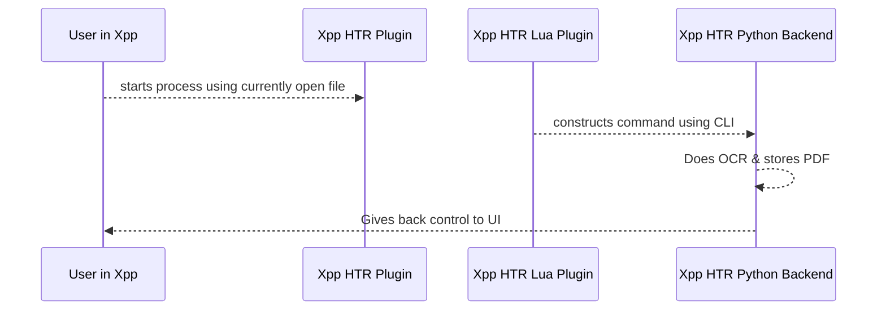

# Developer Guide

TODO

## Installation

TODO

## Project design

The design of Xournal++ HTR tries to bridge the gap between both delivering a production ready product and allowing contributors to experiment with new algorithms.

The project design involves a Lua plugin and a Python backend, see the following figure. First, the production ready product is delivered by means of an Xournal++ plugin. The plugin is fully integrated in Xournal++ and calls a Python backend that performs the actual transcription. The Python backend allows selection of various recognition models and is thereby fully extendable with new models.

    
    
<i>Design of xournalpp_htr.</i>

An alternative figure is shown below: (todo: restructure readme)

Developing a usable HTR systems requires experimentation. The project structure is set up to accommodate this need. *Note that ideas on improved project structures are appreciated.*

The experimentation is carried out in terms of "concepts". Each concept explores a different approach to HTR and possibly improves over previous concepts, but not necessarily to allow for freedom in risky experiments. Concept 1 is already implemented and uses a computer vision approach that is explained below.

Future concepts might explore:
- Retrain computer vision models from concept 1 using native data representation of [Xournal++](https://github.com/xournalpp/xournalpp)
- Use sequence-to-sequence models to take advantage of native data representation of [Xournal++](https://github.com/xournalpp/xournalpp)
- Use data augmentation to increase effective size of training data
- Use of language models to correct for spelling mistakes

### Concept 1

This concept uses computer vision based algorithms to first detect words on a page and then to read those words.

The following shows a video demo on YouTube using real-life handwriting data from a Xournal file:

Despite not being perfect, the main take away is that the performance is surprisingly good given that the underlying algorithm has not been optimised for Xournal++ data at all.

**The performance is sufficiently good to be useful for the Xournal++ user base.**

Feel free to play around with the demo yourself using [this code](https://github.com/PellelNitram/xournalpp_htr/blob/master/scripts/demo_concept_1.sh) after [installing this project](installation.md). The "concept 1" is also what is currently used in the plugin and shown in the [90 seconds demo](https://www.youtube.com/watch?v=boXm7lPFSRQ).

Next steps to improve the performance of the handwritten text recognition even further could be:
- Re-train the algorithm on Xournal++ specific data, while potentially using data augmentation.
- Use language model to improve text encoding.
- Use sequence-to-sequence algorithm that makes use of [Xournal++](https://github.com/xournalpp/xournalpp)'s data format. This translates into using online HTR algorithms.

I would like to acknowledge [Harald Scheidl](https://github.com/githubharald) in this concept as he wrote the underlying algorithms and made them easily usable through [his HTRPipeline repository](https://github.com/githubharald/HTRPipeline) - after all I just feed his algorithm [Xournal++](https://github.com/xournalpp/xournalpp) data in concept 1. [Go check out his great content](https://githubharald.github.io/)!

## Code quality

We try to keep up code quality as high as practically possible. For that reason, the following steps are implemented:

- Testing. Xournal++ HTR uses `pytest` for implementing unit, regression and integration tests.
- Linting. Xournal++ HTR uses `ruff` for linting and code best practises. `ruff` is implemented as git pre-commit hook. Since `ruff` as pre-commit hook is configured externally with `pyproject.toml`, you can use the same settings in your IDE if you wish to speed up the process.
- Formatting. Xournal++ HTR uses `ruff-format` for consistent code formatting. `ruff-format` is implemented as git pre-commit hook. Since `ruff-format` as pre-commit hook is configured externally with `pyproject.toml`, you can use the same settings in your IDE if you wish to speed up the process.