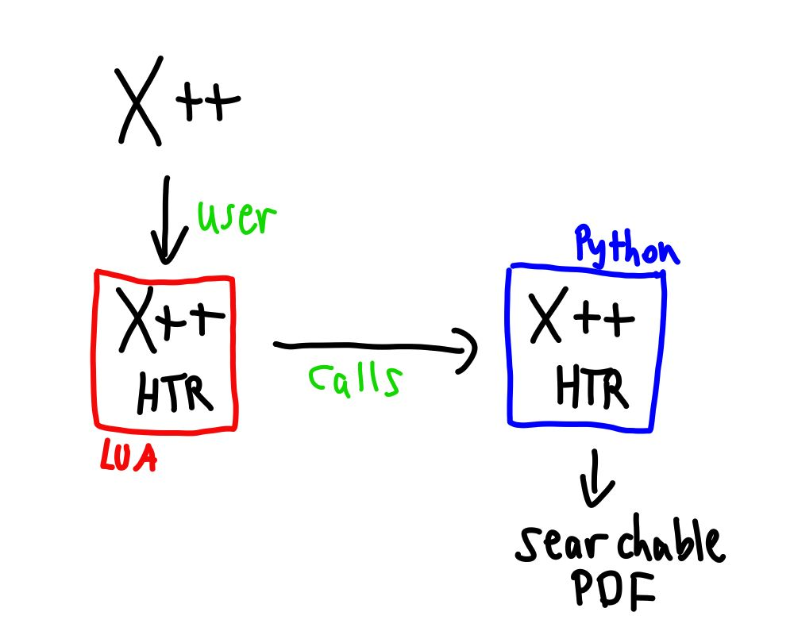
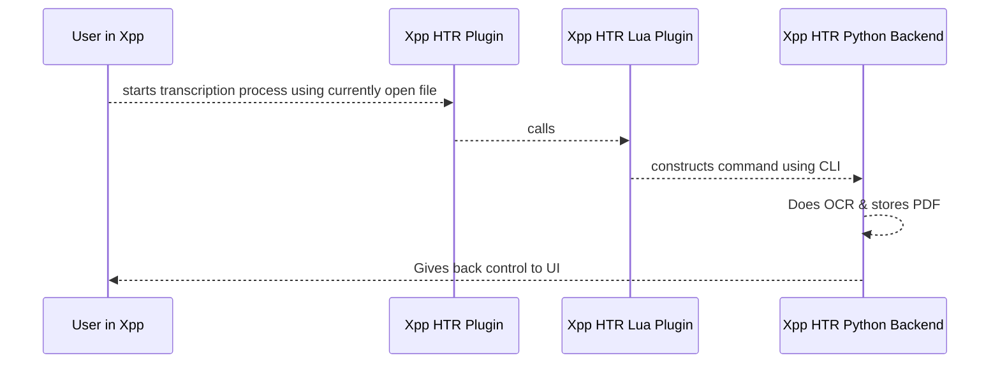

# Developer Guide

## Project design

The design of Xournal++ HTR tries to bridge the gap between both delivering a production ready product and allowing contributors to experiment with new algorithms.

The project design involves a Lua plugin and a Python backend, see the following figure. First, the production ready product is delivered by means of an Xournal++ plugin. The plugin is fully integrated in Xournal++ and calls a Python backend that performs the actual transcription. The Python backend allows selection of various recognition models and is thereby fully extendable with new models.

<!--
DOESN'T WORK SOMEHOW:
<div align="center">
    
    <p><i>Design of xournalpp_htr.</i></p>
</div>
-->

<!-- An alternative figure is shown below: -->


```mermaid
sequenceDiagram
    User in Xpp-->>Xpp HTR Plugin: starts transcription process using currently open file
    Xpp HTR Plugin -->> Xpp HTR Lua Plugin: calls
    Xpp HTR Lua Plugin -->>Xpp HTR Python Backend: constructs command using CLI
    Xpp HTR Python Backend -->> Xpp HTR Python Backend: Does OCR & stores PDF
    Xpp HTR Python Backend-->>User in Xpp: Gives back control to UI
```

Developing a usable HTR systems requires experimentation. The project structure is set up to accommodate this need. *Note that ideas on improved project structures are appreciated.*

The experimentation is carried out in terms of "concepts". Each concept explores a different approach to HTR and possibly improves over previous concepts, but not necessarily to allow for freedom in risky experiments. Concept 1 is already implemented and uses a computer vision approach that is explained below.

Future concepts might explore:

- Retrain computer vision models from concept 1 using native online data representation of [Xournal++](https://github.com/xournalpp/xournalpp)
- Use sequence-to-sequence models to take advantage of native online data representation of [Xournal++](https://github.com/xournalpp/xournalpp); e.g. use [OnlineHTR](https://github.com/PellelNitram/OnlineHTR)
- Use data augmentation to increase effective size of training data
- Use of language models to correct for spelling mistakes

### Concept 1

This concept uses computer vision based algorithms to first detect words on a page and then to read those words.

The following shows a video demo on YouTube using real-life handwriting data from a Xournal file:

[](https://www.youtube.com/watch?v=FGD_O8brGNY)

Despite not being perfect, the main take away is that the performance is surprisingly good given that the underlying algorithm has not been optimised for Xournal++ data at all.

**The performance is sufficiently good to be useful for the Xournal++ user base.**

Feel free to play around with the demo yourself using [this code](https://github.com/PellelNitram/xournalpp_htr/blob/master/scripts/demo_concept_1.sh) after [installing this project](installation_user.md). The "concept 1" is also what is currently used in the plugin and shown in the [90 seconds demo](https://www.youtube.com/watch?v=boXm7lPFSRQ).

Next steps to improve the performance of the handwritten text recognition even further could be:

- Re-train the algorithm on Xournal++ specific data, while potentially using data augmentation.
- Use language model to improve text encoding.
- Use sequence-to-sequence algorithm that makes use of [Xournal++](https://github.com/xournalpp/xournalpp)'s data format. This translates into using online HTR algorithms.

I would like to acknowledge [Harald Scheidl](https://github.com/githubharald) in this concept as he wrote the underlying algorithms and made them easily usable through [his HTRPipeline repository](https://github.com/githubharald/HTRPipeline) - after all I just feed his algorithm [Xournal++](https://github.com/xournalpp/xournalpp) data in concept 1. [Go check out his great content](https://githubharald.github.io/)!

## Benchmarking

Pipelines are evaluated against the [`xournalpp_htr_benchmark`](https://huggingface.co/datasets/PellelNitram/xournalpp_htr_benchmark) dataset on HuggingFace. The dataset is downloaded automatically on first run and cached locally.

Run the benchmark with the default pipeline:

```bash
uv run python scripts/run_benchmark.py
```

To benchmark a specific pipeline or change the output format:

```bash
uv run python scripts/run_benchmark.py --pipeline 2024-07-18_htr_pipeline
uv run python scripts/run_benchmark.py --pipeline 2026-06-07_local_pipeline
uv run python scripts/run_benchmark.py --format json
```

To inspect the predictions visually, pass an output file with `-o`/`--html-report`:

```bash
uv run python scripts/run_benchmark.py --html-report report.html
```

This renders every page of every benchmark sample and draws the pipeline's predictions on top of the handwriting, coloured by outcome: the text was read correctly, the text was misread, or the prediction has no ground truth word behind it. Ground truth words the pipeline did not find are underlined instead. The report is a single self-contained HTML file (roughly 1 MB for the current dataset) that needs no network access to view. Collecting the data and rendering the pages costs extra time, so it only happens when the flag is given.

### Evaluation methodology

The benchmark reports precision, recall, and CER (case-sensitive and case-insensitive).

A prediction counts as having found a ground truth word when it covers at least 80% of that word's bounding box and is at most 8 times its area. Predictions and ground truth words are then paired greedily, one to one within a page, tightest fit first. Intersection over union is deliberately not the criterion: word detectors pad their boxes, and because IoU divides by the union, that padding is negligible on long words but overwhelming on short ones — a perfectly placed box around "is" scores about 0.2 and would be counted as both a miss and a false positive.

Precision and recall are computed over these pairs, so they measure detection. CER is computed only over matched pairs, so a word the pipeline never found does not contribute to it — detection failures show up in recall, not in CER.

See `xournalpp_htr/benchmark.py` for the implementation, and ADR 005 for the coordinate system that ground truth and predictions share.