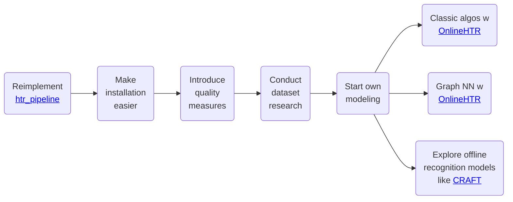

On this page, we outline the project's intended roadmap. This plan helps us strategically manage our time and resources.

Below, we present our roadmap. It may evolve over time, so we will preserve previous versions to maintain transparency.

## Roadmap as of *2025-05-03*

### Visual Overview

### Explanation

This project has many potential directions, with the primary goal of delivering optimal value to users. While we are eager to implement advanced machine learning algorithms, we must first focus on usability improvements.

Our main mid-term objective is to simplify the installation process, as users have reported it is too complex.

Explanation of the steps:

- **Reimplement [htr_pipeline](https://github.com/githubharald/HTRPipeline):**  
  We currently use the awesome [htr_pipeline](https://github.com/githubharald/HTRPipeline) by [Harald Scheidl](https://github.com/githubharald) project for machine learning, but its external dependencies complicate installation. To simplify setup and enhance our understanding of model training for (online/offline) handwriting data, we plan to reimplement these models ourselves. There is no license in the original repository so that we cannot copy over the code but need to reimplement ourselves (with inspiration of course).

- **Introduce quality measures:**  
  To identify the best model, we need to quantify performance. Ideally, one metric will suffice, but two may be necessary if recognition and transcription remain separate tasks.

- **Classic algos w [OnlineHTR](https://github.com/PellelNitram/OnlineHTR):**  
  The plan is to use [OnlineHTR](https://github.com/PellelNitram/OnlineHTR) for transcription alongside classical (non-data-driven) algorithms for recognition.

- **Graph NN w [OnlineHTR](https://github.com/PellelNitram/OnlineHTR):**  
  We aim to use [OnlineHTR](https://github.com/PellelNitram/OnlineHTR) for transcription and a graph neural network for recognition. This approach seeks to develop a high-performing model that operates on the native online representation of handwriting.