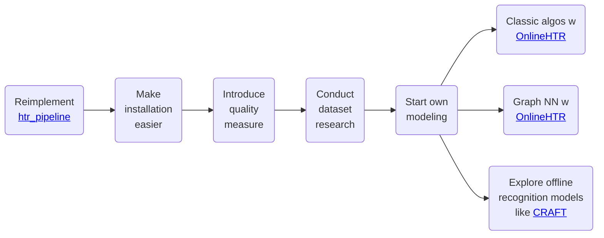

On this page, we outline the project's intended roadmap. This plan helps us strategically manage our time and resources.

Below, we present our roadmap. It may evolve over time, so we will preserve previous versions to maintain transparency.

## Roadmap as of *2025-05-03*

### Visual Overview

### Explanation

There is a myriad of directions this project could go. As user-centric project, the biggest goal is to deliver the best value for the user. This means implementing fancy ML algos (which we totally want!) needs to wait a wee bit.

The main mid-term goal is to make it easier to install the project. Users have told us that the installation process is a burden and too complicated.

Explanation of the steps where necessary:

- "Reimplement [htr_pipeline](https://github.com/githubharald/HTRPipeline)": Currently, this project uses the great [htr_pipeline](https://github.com/githubharald/HTRPipeline) project to deliver the machine learning part. However, this increases the complexity of the installation process because of the externally hosted model file artifacts. In order to reduce this complexity, we will reimplement the models used in [htr_pipeline](https://github.com/githubharald/HTRPipeline); this is a bit more labour intense b/c there is no license stated in the [htr_pipeline](https://github.com/githubharald/HTRPipeline) repo, which will require us to  reimplement the models ourselves. 
    - htr_pipeline has no license
    - status quo of project
    - helps to learn about training a model for the present online handwriting data problem with existing solution for offline handwriting.
    - helps to easier install the package
- "Introduce quality measure":
    - in order to find the best model, we need to quantify how well a model works.
    - ideally, this is one metric but if recognition and transcription remain two subsequent tasks, two metrics might be required
- "Graph NN w [OnlineHTR](https://github.com/PellelNitram/OnlineHTR)":
    - idea is to use OnlineHTR for transcription and a graph NN for recognition.
    - This is a model idea to obtain a high-performing recognition model that operates on the online (& thereby native) representation of the handwriting.
- "Classic algos w [OnlineHTR](https://github.com/PellelNitram/OnlineHTR)":
    - idea is to use OnlineHTR for transcription and a classical (non data-driven) algo to perform the recognition.