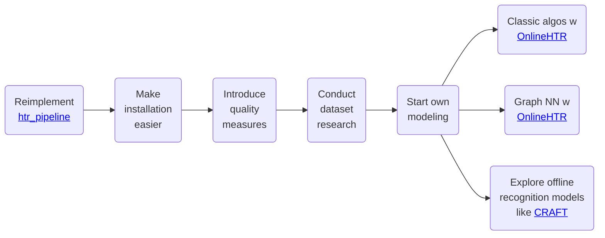

On this page, we outline the project's intended roadmap. This plan helps us strategically manage our time and resources.

Below, we present our roadmap. It may evolve over time, so we will preserve previous versions to maintain transparency.

## Roadmap as of *2025-05-03*

### Visual Overview

### Explanation

This project has many potential directions, with the primary goal of delivering optimal value to users. While we are eager to implement advanced machine learning algorithms, we must first focus on usability improvements.

Our main mid-term objective is to simplify the installation process, as users have reported it is too complex.

Explanation of the steps:

- **Reimplement [htr_pipeline](https://github.com/githubharald/HTRPipeline):**  
  We currently use the excellent [htr_pipeline](https://github.com/githubharald/HTRPipeline) by [Harald Scheidl](https://github.com/githubharald) for machine learning, but it being an external dependency complicates installation and them hosting model weights on Dropbox is not suitable for our needs. To address this, we plan to integrate these models directly into our project. Since the original repository lacks a license, we'll implement our own version, drawing inspiration from the existing work. This approach will deliver an easy-to-install product quickly, as we already know the requirements & model details. Additionally, it enhances our understanding of training models for both online and offline handwriting data. With our own models, we'll automate model retrieval and establish a model registry, likely using [Hugging Face](https://huggingface.co/), as part of adhering to MLOps best practices. Experimentation with new algorithms will benefit from the model registry and will occur subsequently, as it is more time-consuming.

- **Make installation easier:**  
  We aim to make the installation process seamless across platforms, including Linux and Windows, with future support for Mac if access becomes available to us. Implementing a model registry will streamline model management and deployment, aiding future model development and enhancing ease of use while aligning with best practices.

- **Introduce quality measures:**  
  To identify the best model, we need to quantify performance. Ideally, one metric will suffice, but two may be necessary if recognition and transcription remain separate tasks.

- **Classic algos w [OnlineHTR](https://github.com/PellelNitram/OnlineHTR):**  
  The plan is to use [OnlineHTR](https://github.com/PellelNitram/OnlineHTR) for transcription alongside classical (non-data-driven) algorithms for recognition.

- **Graph NN w [OnlineHTR](https://github.com/PellelNitram/OnlineHTR):**  
  We aim to use [OnlineHTR](https://github.com/PellelNitram/OnlineHTR) for transcription and a graph neural network for recognition. This approach seeks to develop a high-performing model that operates on the native online representation of handwriting.